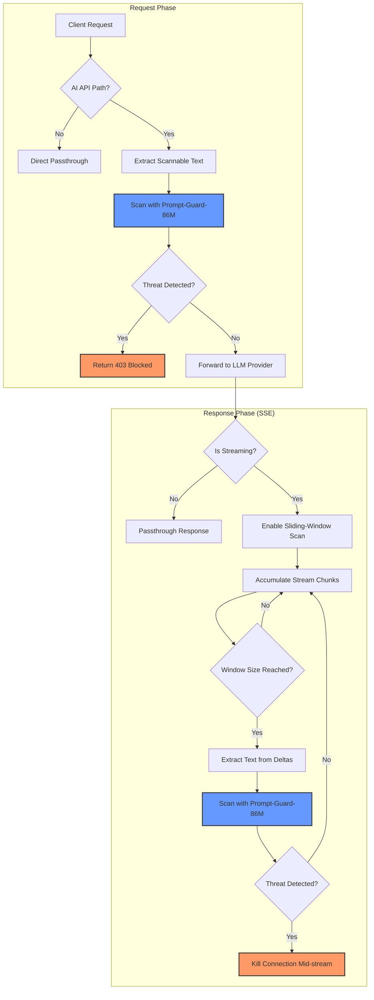

# Prompt Guard 86M – mitmproxy Firewall

This project implements a high-performance **mitmproxy** addon that intercepts AI API traffic to detect and block Prompt Injections and Jailbreaks using Meta's [Prompt-Guard-86M](https://huggingface.co/meta-llama/Prompt-Guard-86M) model.

## Features

- **Selective Interception**: Only scans traffic matching AI API paths (e.g., `/v1/chat/completions`).
- **Role-Aware Extraction**: Surgically targets untrusted data like `tool` results (crawled web content) and `user` messages while skipping bulky system prompts.
- **Two-Layer Defense**: 
    1. **Request Scanning**: Blocks malicious payloads before they reach the LLM.
    2. **Sliding-Window Response Scanning**: Kills the connection mid-stream if the AI starts generating poisoned content.
- **Automated XML Detection**: Detects and scans tool-like tags (`<crawlResults>`, etc.) even if they are buried in assistant or user roles.

## Event Flow



---

## 1. Setup & Model Access

The model is hosted on Hugging Face and requires explicit access from Meta.

### Request Access
1. Visit the [Meta-Llama/Prompt-Guard-86M](https://huggingface.co/meta-llama/Prompt-Guard-86M) page.
2. Log in to Hugging Face and submit the request form to Meta. Access is usually granted instantly or within a few hours.

### Get your Hugging Face Token
1. Go to [Hugging Face Settings -> Access Tokens](https://huggingface.co/settings/tokens).
2. Create a new token with at least `read` permissions.
3. Save this token; you will need it for the `HUGGINGFACE_TOKEN` environment variable.

---

## 2. Configuration (`guard.yaml`)

The behavior of the firewall is controlled via `guard.yaml`. 

```yaml
scanning:
  prompt_threshold: 0.6    # Sensitivity for Jailbreaks (0.0 to 1.0)
  document_threshold: 0.3  # Sensitivity for Indirect Injections (Lower = stricter)
  scan_window_size: 200    # Chars to buffer before a stream scan

request:
  scan_roles:              # Roles to explicitly scan
    - tool
    - assistant
    # - user
  extract_fields:          # JSON keys to look for scannable text
    - messages
    - prompt
    - input
```

---

## 3. Trusting the Proxy Certificate

Because the proxy performs Man-in-the-Middle (MITM) decryption to scan HTTPS traffic, your AI clients (like openclaw) must trust the proxy's CA certificate.

### For Openclaw / LobeHub / Node.js / Ollama
If running in Docker, you can pass the certificate to the Node process using the `NODE_EXTRA_CA_CERTS` environment variable.

1. **Locate the Cert**: The cert is generated on the first run at `~/mitmproxy/mitmproxy-ca-cert.pem` (or inside the container volume).
2. **Mount the Volume**: Ensure your AI application container has access to the certificates volume.
3. **Set Environment Variable**:
   ```bash
   NODE_EXTRA_CA_CERTS=/path/to/certs/mitmproxy-ca-cert.pem
   ```

### For OS Level
- **macOS**: Double-click `mitmproxy-ca-cert.pem`, add to Keychain, and set to "Always Trust".
- **Linux**: Copy to `/usr/local/share/ca-certificates/` and run `update-ca-certificates`.

---

## 4. Running the Proxy

Using Docker Compose:
```bash
# Add your token to .env
HUGGINGFACE_TOKEN=your_token_here

# Start the proxy
docker-compose up -d
```

Access the UI to see live scans and blocks at `http://localhost:5001`.
If the blocks becomes persistent, there are posion memories carry over into your new session. You need to clear the memories of the LLM.